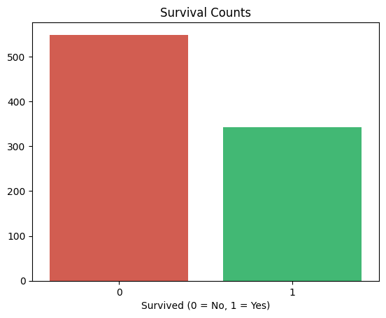
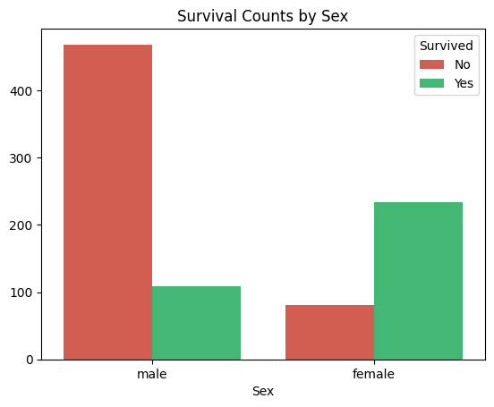
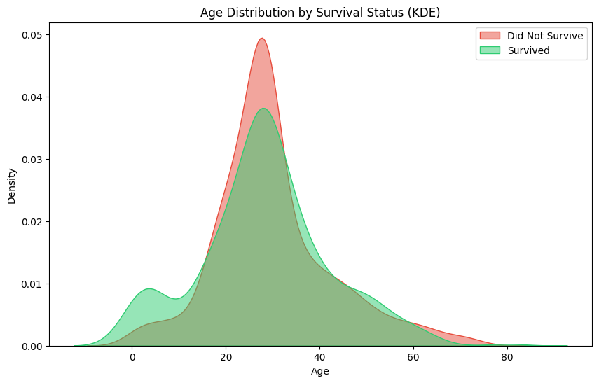
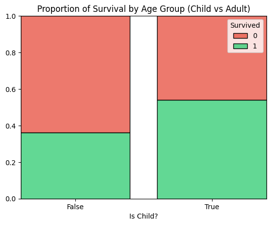
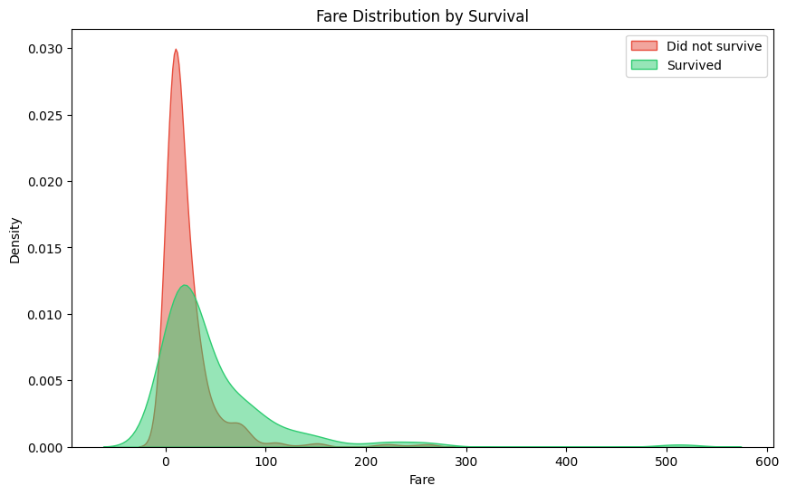
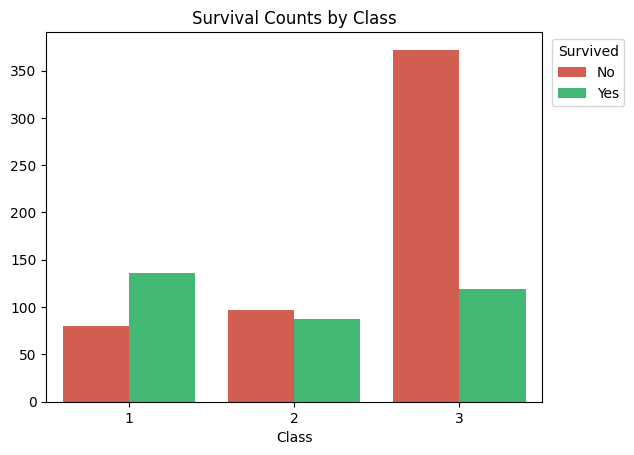

# Titanic Dataset EDA - EDA & Viz. Practice in Python

This beginner-friendly project explores the classic Titanic dataset through basic exploratory data analysis (EDA), aiming to uncover factors that influenced survival while providing hands-on practice with Python, pandas, seaborn, and version control using Git and GitHub.

The Notebook used for analysis can be found in `./notebooks/eda_titanic.ipynb` and all generated plots/visualizations in `./figures`.

## Dataset

- Titanic Dataset - Kaggle
- Includes passenger demographics, ticket info, fare, and survival status

## Tools Used

- Python 
- pandas, seaborn, matplotlib, missingno
- Jupyter Notebook 
- Git & GitHub for version control

## Key Insights

- Unfortunately, most passengers did not survive the Titanic disaster, as is widely known.
    
    
 

- Sex and age played a critical role in survival: women and children had significantly higher survival rates, probably reflecting the "women and children first" evacuation policy.

    

    

    
 

- Passenger class and fare were strong indicators of survival — passengers in first class and those who paid higher fares were more likely to survive, revealing a clear socioeconomic divide.

    

    
 

- These patterns suggest non-random survival behavior, making the dataset well-suited for future predictive modeling based on selected features.
